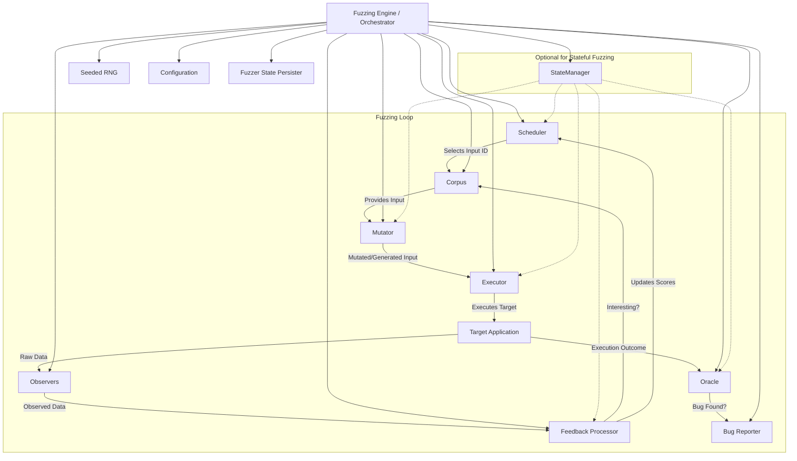

# **Drifter Design Document**
> Drifter is primarily an extensible fuzzing framework in Rust, with an initial focus on excelling at stateful network protocol fuzzing.

Version: 1.0.0
**Date:** May 7, 2025

**Table of Contents:**
1. **Introduction & Vision**
    * 1.1. What is Drifter? (Framework with Specialization)
    * 1.2. Core Philosophy & Tenets
    * 1.3. Key Objectives (General Framework & Stateful/Network Focus)
2. **Roadmap & Milestones**
    * 2.1. Phase 1: Core Extensible Fuzzing Framework (MVP)
        * 2.1.1. MVP Deliverables
        * 2.1.2. MVP Subtasks (Illustrative)
    * 2.2. Phase 2: Advanced Stateful Network Protocol Fuzzing (Post-MVP Release 1)
        * 2.2.1. Deliverables
        * 2.2.2. Subtasks (Illustrative)
    * 2.3. Phase 3: Broader Applications & Advanced Techniques (Future Releases)
3. **Core Architecture: The Extensible Framework**
    * 3.1. Guiding Principles
    * 3.2. Fundamental Fuzzing Loop & Component Interactions (Diagram)
    * 3.3. Core Component Traits:
        * 3.3.1. `Input` Representation
        * 3.3.2. `Mutator<I: Input>`
        * 3.3.3. `Executor<I: Input>`
        * 3.3.4. `Observer`
        * 3.3.5. `Feedback<C: Corpus>`
        * 3.3.6. `Corpus<I: Input>`
        * 3.3.7. `Scheduler<C: Corpus>`
        * 3.3.8. `Oracle<I: Input>`
    * 3.4. Fuzzer State, Configuration, and Reproducibility
4. **Specialization: Stateful Network Protocol Fuzzing**
    * 4.1. Architectural Integration: How Stateful Components Use Core Traits
    * 4.2. Specialized Components Overview (Table)
    * 4.3. `StateManager` Component
        * 4.3.1. Responsibilities & Data Model (Protocol State Machine)
        * 4.3.2. Conceptual API & Session Data
    * 4.4. `StatefulInputGenerator` (Specialized `Mutator` or Coordinator)
        * 4.4.1. Strategies & API
    * 4.5. `NetworkInteractor` (Specialized `Executor`)
        * 4.5.1. Async I/O, Connection Management, Serialization, API
    * 4.6. `ProtocolOracle` (Specialized `Oracle`)
        * 4.6.1. Detection Mechanisms
    * 4.7. Data Models for Protocols (Messages, Session State - with Rust examples)
5. **Testing Strategy: Foundation of Confidence**
    * 5.1. Unit Tests
    * 5.2. Integration Tests (Core Framework & Stateful Specialization)
    * 5.3. Deterministic Simulation Testing (DST) - Especially for Network Logic
    * 5.4. Snapshot Testing (`insta`)
    * 5.5. Property-Based Testing (`proptest`/`quickcheck`)
    * 5.6. Benchmarking (`criterion`)
    * 5.7. Meta-Fuzzing (Fuzzing Drifter itself)
6. **Technology Stack & Dependencies**
    * 6.1. Core Libraries
    * 6.2. Testing Libraries
    * 6.3. Optional Libraries (via Cargo features)
    * 6.4. Dependency Policy
7. **Rust Style Guide, Naming, and Best Practices**
    * 7.1. Automated Tools (`rustfmt`, `clippy`)
    * 7.2. Naming Conventions (Referencing RFC 430, API Guidelines)
    * 7.3. API Design Principles (Clarity, Conversions, Booleans, Getters)
    * 7.4. Error Handling (`thiserror`, `eyre`/`anyhow`)
    * 7.5. Documentation (Code comments, `mdBook`)
    * 7.6. Defensive Programming and Invariants
8. **Project Structure (Cargo Workspace)**
9. **Infrastructure & CI/CD**
10. **Risk Assessment & Mitigation**
11. **Extensibility & Future Vision (Beyond current roadmap)**
    * 11.1. Protocol Learning/Inference
    * 11.2. Other Advanced Techniques

---

### 1. Introduction & Vision

**1.1. What is Drifter? (Framework with Specialization)**

Drifter is an open-source, extensible fuzzing framework written in Rust, designed for high performance and reliability. While its core architecture provides a versatile foundation for fuzzing diverse targets, Drifter's initial and primary development focus is to excel at uncovering vulnerabilities in **stateful network protocol implementations**. It aims to achieve this by modeling protocol state machines and generating contextually valid message sequences that explore deep protocol logic.

**1.2. Core Philosophy & Tenets**
* **Extensibility First:** A modular, trait-based design allows easy integration of new techniques and target types.
* **Performance by Design:** Leverage Rust's strengths for efficient fuzzing loops and low-overhead components.
* **Reliability through Rigor:** The fuzzer itself must be robust. Deterministic reproducibility and comprehensive testing are paramount.
* **Developer Velocity & Maintainability:** Clear architecture and strong testing enable rapid, confident development.
* **Focus on Impact:** Prioritize features that deliver high value for challenging targets like stateful protocols.

**1.3. Key Objectives**
* **Framework Objectives:**
    * Provide a library of composable fuzzing primitives.
    * Enable users to easily define and integrate custom components.
    * Support various target types (libraries, binaries, file formats, network services).
* **Stateful Network Protocol Fuzzing Objectives (Initial Specialization):**
    * Accurately model and track protocol state machines and session context.
    * Generate state-respecting message sequences for deeper coverage.
    * Detect crashes, hangs, timeouts, protocol specification violations, and logic errors.
    * Offer high-throughput fuzzing for network targets via asynchronous operations.

---

### 2. Roadmap & Milestones

**2.1. Phase 1: Core Extensible Fuzzing Framework (MVP)**
* **Goal:** A functional, coverage-guided fuzzing framework capable of fuzzing simple, stateless targets.
* **2.1.1. MVP Deliverables:**
    * Implementation of core traits (see Section 3.3).
    * Basic fuzzing engine orchestrating these components.
    * Seedable RNG for deterministic runs.
    * Basic CLI for configuration (`clap`).
    * Fuzzer state persistence (`serde`).
    * Comprehensive unit and integration tests. Initial snapshot tests.
*  **2.1.2. MVP Subtasks (Illustrative):**
    * Define and implement core `Input`, `Mutator` (e.g., `ByteFlipMutator`), `Executor` (e.g., `InProcessExecutor`), `Observer` (e.g., `SharedMapCoverageObserver`), `Feedback` (e.g., `BitmapCoverageFeedback`), `Corpus` (e.g., `InMemoryCorpus`), `Scheduler` (e.g., `RandomScheduler`), `Oracle` (e.g., `ExitCodeOracle`) traits and initial implementations.
    * Develop the main fuzzing loop in the `Engine`.
    * Implement `serde` for saving/loading fuzzer state (corpus, RNG, scheduler state).
    * Create a basic CLI using `clap` for target specification and essential parameters.
    * Write unit tests for each component and an integration test for the end-to-end loop with a mock target.

**2.2. Phase 2: Advanced Stateful Network Protocol Fuzzing (Post-MVP Release 1)**
* **Goal:** Extend the framework to effectively fuzz a specific stateful network protocol (e.g., a subset of MQTT).
* **2.2.1. Deliverables:**
    * `StateManager` component (design and implementation).
    * `StatefulInputGenerator` (specialized `Mutator` or coordinator).
    * `NetworkInteractor` (specialized `Executor`).
    * `ProtocolOracle` (specialized `Oracle`).
    * Integration of state transition coverage into `Feedback` and `Scheduler`.
    * Target protocol module for MQTT subset (or similar).
    * Robust logging (`tracing`).
    * **Deterministic Simulation Testing (DST):** Test harnesses using `madsim` or `turmoil`.
* **2.2.2. Subtasks (Illustrative):**
    * Design and implement the `StateManager` to load protocol definitions (e.g., YAML/JSON or Rust structs) and manage session state.
    * Develop a `StatefulInputGenerator` that uses the `StateManager` to create valid message sequences.
    * Implement a `NetworkInteractor` using `tokio` for async TCP/UDP communication.
    * Create a `ProtocolOracle` for the chosen target protocol to detect protocol-specific errors.
    * Enhance `Feedback` and `Scheduler` components to understand and prioritize state/transition coverage.
    * Set up DST environments to test network components rigorously.
    * Write extensive integration tests for the stateful fuzzing capabilities.

**2.3. Phase 3: Broader Applications & Advanced Techniques (Future Releases)**
* **Goal:** Mature the framework with advanced fuzzing techniques, broader protocol support, and optimizations.
* **Potential Deliverables:** Additional `Executor`s (`ForkServerExecutor`, `SnapshotExecutor`), advanced `Mutator`s (structure-aware, grammar-based), more sophisticated `Scheduler`s, support for more protocols, corpus minimization, UI/Visualization, Parallel/Distributed fuzzing.

---

### 3. Core Architecture: The Extensible Framework

**3.1. Guiding Principles**
Modularity, Trait-Based Abstraction, Performance, Testability.

**3.2. Fundamental Fuzzing Loop & Component Interactions**


* **Orchestrator:** Manages the loop, components, state, and configuration.
* **StateManager (Optional):** In stateful fuzzing, it guides input generation, informs execution context, and helps interpret feedback/oracle results.

**3.3. Core Component Traits**
(Conceptual Signatures - actual implementation will involve specific error types, more refined generics, and `async_trait` where appropriate.)

**3.3.1. `Input` Representation**
```rust
pub trait Input: Clone + Send + Sync + std::fmt::Debug + 'static {
    fn as_bytes(&self) -> &[u8];
    // fn len(&self) -> usize; // Consider adding
}
impl Input for Vec<u8> { /* ... */ }
// Other structured inputs will also implement this.
```

**3.3.2. `Mutator<I: Input>`**
```rust
use rand_core::RngCore;

pub trait Mutator<I: Input> {
    // input_opt allows for generation from scratch if None
    // corpus_opt provides access to other corpus entries for splicing, etc.
    fn mutate(&mut self, input_opt: Option<&I>, rng: &mut dyn RngCore, corpus_opt: Option<&dyn Corpus<I>>) -> Result<I, anyhow::Error>; // Using anyhow for example error type
}
```

**3.3.3. `Executor<I: Input>`**
```rust
use std::any::Any;

pub enum ExecutionStatus { Ok, Timeout, Crash(String), Other(String) }
pub trait Executor<I: Input> {
    // Observers are passed mutably to allow them to store state related to this execution
    async fn execute(&mut self, input: &I, observers: &mut [&mut dyn Observer]) -> ExecutionStatus;
    // Optional: fn get_target_output(&self) -> Option<Box<dyn Any>>; // For Oracle to inspect stdout/stderr etc.
}
```

**3.3.4. `Observer`**
```rust
use std::collections::HashMap;

pub trait Observer: Send + Sync {
    fn name(&self) -> &'static str;
    fn pre_exec(&mut self) -> Result<(), anyhow::Error>;
    fn post_exec(&mut self, status: &ExecutionStatus, target_output: Option<&dyn Any>) -> Result<(), anyhow::Error>;
    fn reset(&mut self) -> Result<(), anyhow::Error>; // Reset for the next execution
    fn serialize_data(&self) -> Option<Vec<u8>>; // Data for Feedback processors
}
```

**3.3.5. `Feedback<C: Corpus<Input = I>, I: Input>`**
```rust
pub trait Feedback<C: Corpus<Input = I>, I: Input>: Send + Sync {
    fn name(&self) -> &'static str;
    // init can be used to load global feedback state, e.g. total coverage map
    fn init(&mut self, corpus: &C) -> Result<(), anyhow::Error>;
    // observers_data: key is observer name, value is its serialized_data
    fn is_interesting(&mut self, input: &I, observers_data: &HashMap<&'static str, Option<Vec<u8>>>, corpus: &C) -> Result<bool, anyhow::Error>;
    // If interesting, add to corpus. Also responsible for updating global feedback state.
    fn report_interesting(&mut self, input: I, observers_data: &HashMap<&'static str, Option<Vec<u8>>>, corpus: &mut C) -> Result<(), anyhow::Error>;
}
```

**3.3.6. `Corpus<I: Input>`**
```rust
pub trait Corpus<I: Input>: Send + Sync {
    // metadata can store info like discovery time, fuzzer that found it, coverage achieved
    fn add(&mut self, input: I, metadata: Box<dyn Any>) -> Result<usize /* id */, anyhow::Error>;
    fn get(&self, id: usize) -> Option<(&I, &Box<dyn Any>)>;
    fn random_select(&self, rng: &mut dyn RngCore) -> Option<(usize, &I, &Box<dyn Any>)>; // Returns id, input, metadata
    fn len(&self) -> usize;
    // Potentially: fn store(&self, path: &Path) -> Result<(), Error>;
    // Potentially: fn load(&mut self, path: &Path) -> Result<(), Error>;
    // Potentially: fn update_metadata(&mut self, id: usize, new_metadata: Box<dyn Any>) -> Result<(), Error>;
}
```

**3.3.7. `Scheduler<C: Corpus<Input = I>, I: Input>`**
```rust
pub trait Scheduler<C: Corpus<Input = I>, I: Input>: Send + Sync {
    fn next(&mut self, corpus: &C, rng: &mut dyn RngCore) -> Result<usize, anyhow::Error>; // Returns ID of input to fuzz next
    // feedback_value could be coverage gain, if it was a solution (crash), etc.
    // Allows scheduler to update priorities/energies.
    fn report_feedback(&mut self, input_id: usize, feedback_value: &dyn Any, is_solution: bool);
}
```

**3.3.8. `Oracle<I: Input>`**
```rust
// BugReport stores info about a discovered bug
pub struct BugReport<I: Input> { pub input: I, pub description: String, pub hash: String, pub severity: u8, /* other details like stack trace string */ }
pub trait Oracle<I: Input>: Send + Sync {
    // target_output could be stdout/stderr from Executor, or specific data from Observers
    fn examine(&self, input: &I, status: &ExecutionStatus, target_output: Option<&dyn Any>) -> Option<BugReport<I>>;
}
```

**3.4. Fuzzer State, Configuration, and Reproducibility**
* **State:** The entire fuzzer state (RNG seed, corpus content and metadata, scheduler state, global feedback state like coverage maps) must be serializable using `serde` for pausing/resuming and deterministic replay.
* **Configuration:** A hierarchical `Config` struct, deserialized from TOML and overridable by CLI args (`clap`). This config will define which implementations of traits to use, their settings, target paths, timeouts, etc.
* **Reproducibility:** Achieved through:
    1. A master seed for all RNG operations.
    2. Deterministic behavior of all components given the same seed, input, and configuration.
    3. Serialization and deserialization of the complete fuzzer state.

---

### 4. Specialization: Stateful Network Protocol Fuzzing

**4.1. Architectural Integration**
Stateful components (StateManager, StatefulInputGenerator, NetworkInteractor, ProtocolOracle) are either specialized implementations of core traits or coordinating components that utilize core traits. The `Fuzzing Engine` will conditionally enable and coordinate with the `StateManager` if the configuration indicates a stateful fuzzing session.

**4.2. Specialized Components Overview**

| Component                 | Core Trait(s) Utilized/Implemented | Key Responsibility for Stateful Fuzzing                            |
| :------------------------ | :--------------------------------- | :----------------------------------------------------------------- |
| `StateManager`            | N/A (New coordinating component)   | Manages protocol state machine, session context.                   |
| `StatefulInputGen`        | `Mutator` (or uses `Mutator`s)     | Generates state-aware message sequences.                           |
| `NetworkInteractor`       | `Executor`                         | Handles async network I/O for a specific protocol.                 |
| `ProtocolOracle`          | `Oracle`                           | Detects protocol-specific violations and logic errors.             |
| State Coverage `Feedback` | `Feedback`, `Observer`             | Tracks and rewards exploration of new protocol states/transitions. |

**4.3. `StateManager` Component**
* **4.3.1. Responsibilities & Data Model:** Maintains protocol state machine (directed graph: nodes=states, edges=transitions with messages/conditions). Loads definitions (YAML, JSON, Rust code). Tracks session state for multiple parallel interactions if needed.
* **4.3.2. Conceptual API & Session Data (from your input "Doc 2"):**
    ```rust
    // Assuming these types are defined elsewhere, specific to a protocol
    // type StateId = usize;
    // struct State { id: StateId, name: String, /* protocol-specific state data */ }
    // struct Transition { from_state: StateId, to_state: StateId, message_type: MessageType, condition: Option<Condition> }
    // enum MessageType { /* ... */ }
    // enum Message { /* ... */ } // Actual message instances
    // enum Response { /* ... */ }
    // struct SessionData { /* ... */ }
    // enum StateError { /* ... */ }

    pub trait StateManager { // Generics for State, Message, etc. will be vital
        fn load_definition(&mut self, source: &str) -> Result<(), anyhow::Error>; // Source for state machine
        fn new_session(&mut self) -> Result<usize /* session_id */, anyhow::Error>;
        fn current_state(&self, session_id: usize) -> Option<&State>; // Using types from Doc 2
        fn allowed_transitions(&self, session_id: usize) -> Vec<Transition>;
        // fn is_valid_transition(&self, session_id: usize, message: &Message) -> bool; // May not be needed if generator uses allowed_transitions
        fn apply_transition(&mut self, session_id: usize, message_sent: &Message, response_received: &Response) -> Result<State, StateError>;
        fn update_session_data(&mut self, session_id: usize, message: &Message, response: &Response);
        fn reset_session(&mut self, session_id: usize);
    }
    ```

**4.4. `StatefulInputGenerator`**
* **Strategies:** State-aware mutation (modifying fields of valid message templates for the current state), grammar-based generation for message structures, sequence mutation (inserting/deleting/reordering valid messages within a sequence). Pluggable.
* **API:**
    ```rust
    // Assuming Message, State, InputGenerationError types are defined
    pub trait StatefulInputGenerator {
        // Needs access to StateManager or current state information
        fn generate_input(&mut self, current_state_info: &State, rng: &mut dyn RngCore) -> Result<Vec<Message>, InputGenerationError>;
    }
    ```
    This would likely be an implementation of the core `Mutator` trait, where `input_opt` is `None` and it uses the `StateManager` (passed via a shared context or during initialization) to generate stateful sequences.

**4.5. `NetworkInteractor` (Specialized `Executor`)**
* **Async I/O:** `tokio`.
* **Connection Management:** Pooling (optional), reconnect logic, configurable timeouts.
* **Serialization:** `serde` for messages. Protocol-specific adapters might be needed for framing/parsing.
* **API:**
    ```rust
    // Assuming Message, Response, NetworkError types are defined
    // This functionality would be part of a specific Executor implementation.
    // pub trait NetworkOperations { // Not a new trait, but methods within an Executor
    //     async fn connect(&mut self, target_addr: &str) -> Result<(), NetworkError>;
    //     async fn send_sequence(&mut self, messages: &[Message]) -> Result<Vec<Response>, NetworkError>;
    //     async fn disconnect(&mut self) -> Result<(), NetworkError>;
    // }
    ```
    The core `Executor::execute` method would encapsulate this logic.

**4.6. `ProtocolOracle` (Specialized `Oracle`)**
* **Detection Mechanisms:** Connection resets, timeouts, malformed responses, crash detection (if target is a local process), protocol violations (unexpected state transitions based on `StateManager`, invalid message sequences, incorrect field values).
* **API:**
    The core `Oracle::examine` method would be implemented. The `target_output` parameter could carry structured response data from the `NetworkInteractor` or state information from an `Observer` linked to the `StateManager`.
    ```rust
    // struct ProtocolBugReportDetails { /* specific to protocol errors */ }
    // An implementation of the core Oracle trait:
    // fn examine(&self, input: &SequenceOfMessages, status: &ExecutionStatus, responses: &[Response], current_state_before_send: &State) -> Option<BugReport<SequenceOfMessages>>;
    ```

**4.7. Data Models for Protocols (Messages, Session State - with Rust examples)**
```rust
// Example from your input "Doc 2":
#[derive(serde::Serialize, serde::Deserialize, Debug, Clone)]
pub enum Message {
    Connect { client_id: String },
    Publish { topic: String, payload: Vec<u8> },
    // ... other message types
}

// Example of implementing the core Input trait for a structured Message
// This might require a specific serialization format for as_bytes, or as_bytes might panic if not applicable.
// Alternatively, the Input trait could be more flexible (e.g. an associated type for serialized form).
// For now, let's assume a debug or placeholder implementation for as_bytes for structured types.
impl crate::drifter_core::input::Input for Message {
    fn as_bytes(&self) -> &[u8] {
        // This is tricky for complex enums. Often, structured inputs are handled differently
        // or serialized to a canonical byte form for certain generic components.
        // For now, a placeholder or a specific serialization strategy (e.g., bincode) is needed.
        // Let's assume for simplicity it might panic or return an empty slice if not directly applicable.
        // A better approach would be to have the Input trait be more nuanced for structured data.
        // For a network protocol, individual messages might be serialized for sending.
        eprintln!("Warning: as_bytes() called on structured Message enum; behavior may be undefined for generic byte-level tools.");
        &[]
    }
}

// Similar structs for State, Transition, SessionData as in your input "Doc 2"
```

---

### 5. Testing Strategy: Foundation of Confidence
A multi-layered testing approach is non-negotiable for development velocity and reliability.

* **5.1. Unit Tests:** (`#[cfg(test)] mod tests { ... }`) For all core logic in isolation (mutators, individual state transitions, parsers, etc.). Aim for >90% code coverage.
* **5.2. Integration Tests:** (`tests/` dir) Verify interactions between Drifter's components.
    * Core framework: Test the fuzzing loop with mock targets and simple `Executor`s/`Mutator`s.
    * Stateful specialization: Test `StateManager` with `NetworkInteractor` against simulated targets or mock protocol servers. Verify state tracking and state-aware input generation.
* **5.3. Deterministic Simulation Testing (DST):**
    * **Critical for stateful network logic.** Use libraries like `madsim`, `turmoil`, or `temper` to create test harnesses. These simulate network behavior (latency, partitions, message reordering, packet drops) and target responses, allowing reproducible testing of complex interactions in `NetworkInteractor`, `StateManager`, and `ProtocolOracle`s.
* **5.4. Snapshot Testing (`insta`):**
    * For generated inputs/sequences, serialized fuzzer state, corpus contents, coverage maps (if applicable), state machine representations after loading, and textual bug reports. Ensures consistency and catches regressions in complex data structures or outputs.
* **5.5. Property-Based Testing (`proptest`/`quickcheck`):**
    * Define properties and invariants for:
        * Mutators (e.g., certain mutations should preserve some structural properties).
        * State machine logic (e.g., all reachable states have valid transitions or are terminal).
        * Serialization/deserialization round-trips.
* **5.6. Benchmarking (`criterion`):**
    * Measure performance of critical components: `Executor` throughput (executions/sec), `Mutator` speed, `Feedback` processing overhead, `Corpus` access times, `StateManager` transition speed. Track performance over time to catch regressions.
* **5.7. Meta-Fuzzing (Fuzzing Drifter itself):**
    * Use `cargo-fuzz` (libFuzzer) to fuzz Drifter's own:
        * Parsers (configuration files, state machine definitions from YAML/JSON).
        * Protocol message deserializers (if any are custom).
        * State (de)serialization logic.
        * Complex input handling paths.

---

### 6. Technology Stack & Dependencies
* **6.1. Core Libraries:**
    * **Rust:** Latest stable version.
    * **`tokio`:** Async runtime.
    * **`serde` (+ `serde_derive`):** Serialization/deserialization.
    * **`clap`:** CLI argument parsing.
    * **`tracing` (+ `tracing-subscriber`):** Structured, asynchronous logging.
    * **`rand` (+ `rand_chacha`):** Random number generation.
    * **`thiserror`:** For library error types.
    * **`eyre` or `anyhow`:** For application-level error handling and context.
* **6.2. Testing Libraries:**
    * **`criterion`:** Benchmarking.
    * **`insta`:** Snapshot testing.
    * **`proptest` / `quickcheck`:** Property-based testing.
    * **`madsim` / `turmoil` / `temper`:** Deterministic Simulation Testing.
    * **`cargo-fuzz` / `libfuzzer-sys`:** For meta-fuzzing.
* **6.3. Optional Libraries (via Cargo features):**
    * **`petgraph`:** For advanced graph operations in `StateManager`.
    * Protocol-specific crates (e.g., `mqtt-protocol`, `http`, `prost`).
* **6.4. Dependency Policy:**
    * Prefer standard library where feasible.
    * Choose mature, well-maintained, and widely used crates.
    * Minimize transitive dependencies. Review with `cargo-tree`.
    * Explicit version pinning in `Cargo.lock` (default).
    * Regularly run `cargo update` and `cargo audit`. Use `cargo-deny` for license/vulnerability checks.
    * Employ feature flags for optional heavy dependencies or platform-specific code.

---

### 7. Rust Style Guide, Naming, and Best Practices
* **7.1. Automated Tools (`rustfmt`, `clippy`)**
    * `rustfmt`: Enforce consistent code formatting (4-space indentation, 100-character line width, trailing commas, blank line rules). Configure via `rustfmt.toml`.
    * `clippy`: Catch common mistakes, enforce idiomatic patterns. Use `#[deny(clippy::all)]`, `#[warn(clippy::pedantic)]` in crate roots, then explicitly `#[allow(...)]` specific lints with justification if necessary.
    * CI must pass `cargo fmt --check` and `cargo clippy --all-targets --all-features -- -D warnings`.
* **7.2. Naming Conventions** (Follow standard Rust naming conventions as outlined in RFC 430 and the Rust API Guidelines):
    * Types/Traits/Enums: `UpperCamelCase` (e.g., `StateManager`, `BugType`).
    * Functions/Methods/Vars/Modules: `snake_case` (e.g., `process_message`, `network_interactor`).
    * Constants/Statics: `SCREAMING_SNAKE_CASE` (e.g., `MAX_TIMEOUT`).
    * Enum Variants: `UpperCamelCase` (e.g., `ExecutionStatus::Ok`).
    * Macros: `snake_case!` (e.g., `println!`).
    * Type Parameters: `UpperCamelCase` (usually concise, often single letters: `T`, `E`).
    * Lifetimes: `'lowercase` (usually short: `'a`, `'static`).
    * Features (Cargo): `snake_case` (e.g., `serde`, `full`).
    * **Descriptive Naming:** Prioritize clarity and expressiveness over brevity. Avoid vague names. Names should accurately convey purpose, meaning, and role.
* **7.3. API Design Principles** (Apply principles from the Rust API Guidelines, even within application code):
    * **Conversion Clarity:** Use `as_`, `to_`, and `into_` prefixes for conversion methods to indicate cost and ownership implications (e.g., `as_bytes()`, `to_string()`, `into_bytes()`).
    * **Boolean Naming:** Use prefixes like `is_`, `has_`, `can_`, or `should_` for boolean variables and functions that return booleans (e.g., `is_empty()`, `has_permission()`).
    * **Getter Naming:** Omit the `get_` prefix for simple field accessors. For mutable access, use the `_mut` suffix (e.g., `config.timeout()`, `config.timeout_mut()`). Reserve `get_` for more complex operations or when returning a copy of an internal value that isn't a simple field.
* **7.4. Error Handling (`thiserror`, `eyre`/`anyhow`)**
    * Use `Result<T, E>` ubiquitously for operations that can fail.
    * Define specific, domain-rich error types per module/major component using `thiserror`.
    * Use `eyre` or `anyhow` for top-level application error reporting, adding context, and handling errors from diverse sources in `main.rs` or CLI layers.
    * Avoid `panic!` in library code. Use it only for truly unrecoverable invariants whose violation indicates a bug in the fuzzer itself, or in tests for expected panics.
* **7.5. Documentation (Code comments, `mdBook`)**
    * **Code Comments:** Explain the "why," not just the "what." Document invariants, pre-conditions, post-conditions, complex logic, and non-obvious choices.
    * **`rustdoc`:** Write comprehensive doc comments for all public APIs (and important internal ones). Include usage examples (`#[test] fn my_example() {}` inside doc comments).
    * **`mdBook`:** For user guides, tutorials, architectural overviews, and this design document itself.
* **7.6. Defensive Programming and Invariants**
    * Use Rust's type system to make illegal states unrepresentable where possible.
    * Clearly document invariants for components and data structures.
    * Use `debug_assert!` for checking invariants in development builds for conditions that should "never" happen if the code is correct.

---

### 8. Project Structure (Cargo Workspace)
```
drifter/
├── Cargo.toml               # Workspace manifest
├── README.md
├── LICENSE
├── .gitignore
├── rustfmt.toml
├── .cargo/config.toml       # For build flags, aliases (e.g., for clippy)
├── docs/                    # mdBook source (including this design doc)
│   └── src/
├── scripts/                 # Helper scripts (build, test, release)
├── fuzz/                    # Targets for fuzzing Drifter itself (using cargo-fuzz)
│   ├── Cargo.toml
│   └── fuzz_targets/
│       └── config_parser.rs # Example fuzz target
├── drifter_core/            # Core library crate (traits, engine, general components)
│   ├── Cargo.toml
│   └── src/
│       ├── lib.rs
│       ├── input.rs
│       ├── mutator.rs
│       ├── executor.rs
│       ├── observer.rs
│       ├── feedback.rs
│       ├── corpus.rs
│       ├── scheduler.rs
│       ├── oracle.rs
│       ├── engine.rs        # Main fuzzing loop orchestrator
│       └── common_types.rs  # Shared error enums, basic structs not tied to a component
├── drifter_protocols/       # Crate for stateful protocol specialization logic
│   ├── Cargo.toml
│   └── src/
│       ├── lib.rs
│       ├── state_manager.rs
│       ├── network_interactor_impls.rs # Implementations of NetworkExecutor for specific protocols
│       ├── stateful_input_gen_impls.rs # Implementations of StatefulInputGenerator
│       └── impls/                      # Protocol-specific modules (e.g., mqtt/)
│           └── mqtt/
│               ├── mod.rs
│               ├── mqtt_state_machine.rs   # Definition of MQTT state machine
│               ├── mqtt_messages.rs        # MQTT message types implementing core Input
│               └── mqtt_oracle_impl.rs     # MQTT specific Oracle implementation
├── drifter_cli/             # Binary crate for the Drifter command-line interface
│   ├── Cargo.toml
│   └── src/
│       └── main.rs
├── examples/                # Example targets and Drifter usage configurations
│   ├── simple_c_target/
│   └── rust_lib_target/
│   └── mqtt_fuzz_config.toml
├── tests/                   # Integration tests for workspace members (testing interactions)
│   ├── common/
│   │   └── mod.rs           # Shared test utilities
│   └── core_integration_tests.rs
│   └── protocol_integration_tests.rs
└── benches/                 # Criterion benchmarks
    ├── Cargo.toml
    └── src/
        └── main_benchmark.rs
```

---

### 9. Infrastructure & CI/CD
* **Version Control:** Git, hosted on GitHub (recommended for GitHub Actions, issue tracking, and community collaboration).
* **CI (GitHub Actions):**
    * On every Pull Request and push to `main` branch:
        1.  **Lint & Format Check:** `cargo fmt --all -- --check`, `cargo clippy --all-targets --all-features -- -D warnings`.
        2.  **Build:** `cargo build --all-targets --all-features` (consider a matrix for different OS: Linux, macOS, Windows if aiming for cross-platform).
        3.  **Test:** `cargo test --all-targets --all-features`.
        4.  **Snapshot Test Check:** `cargo insta test -- ร้านอาหาร` (fail if snapshots changed, use `--accept` manually or in a specific workflow to update).
        5.  **Benchmark Compilation:** `cargo bench --no-run` (ensures benchmarks compile).
        6.  **Meta-Fuzz Target Compilation:** `cd fuzz && cargo fuzz build`.
    * Optional CI jobs:
        * `cargo audit` for security vulnerabilities.
        * Short (e.g., 1-5 min) meta-fuzz runs on critical parsers.
        * Code coverage reporting (e.g., using `cargo-tarpaulin` or `grcov` and uploading to Codecov/Coveralls).
        * Nightly extended fuzzing runs or benchmarking.
* **CD (Continuous Deployment/Delivery):**
    * Automate releases using `cargo-release` (for version bumping, changelog generation from conventional commits, tagging, and publishing to Crates.io).
    * GitHub Releases for binary artifacts of `drifter_cli` (if distributed).
    * Automated deployment of `rustdoc` (API) and `mdBook` (guides) documentation to GitHub Pages on new tags/releases.
* **Development Environment:** Provide a `Dockerfile` and `docker-compose.yml` (or Dev Container configuration) for a consistent, reproducible local development environment with all necessary dependencies.

---

### 10. Risk Assessment & Mitigation

| Risk                                    | Mitigation                                                                                                                  |
| :-------------------------------------- | :-------------------------------------------------------------------------------------------------------------------------- |
| Performance Bottlenecks                 | Async I/O (`tokio`), early/continuous benchmarking (`criterion`), profiling, efficient data structures (`bitvec`).          |
| State Explosion (Stateful Fuzzing)      | Corpus minimization, state pruning strategies in `StateManager`, coverage-guided state exploration, abstraction techniques. |
| Dependency Bloat/Vulnerabilities        | Minimal, well-vetted dependencies; `cargo audit`/`cargo deny`; feature flags; regular updates.                              |
| Protocol Implementation Complexity      | Start with simple/subset protocol; modular design for protocol logic; robust testing (DST); clear state definitions.        |
| Solo Development Velocity / Bus Factor  | Clear roadmap & milestones; comprehensive automated testing (CI/CD); excellent documentation; idiomatic Rust.               |
| Maintaining General Extensibility       | Strict adherence to core trait design; resist over-specializing core components; thorough documentation of framework.       |
| Difficulty in Bug Triage/Reproduction   | Deterministic replay (seeded RNG, `serde` state); detailed `tracing` logs; clear `BugReport`; crash deduplication.          |
| Testing Complexity (especially DST)     | Start with simpler DST scenarios; incrementally build complexity; leverage existing DST libraries effectively.              |
| Unclear Vulnerability Types (Protocols) | Clearly defined `ProtocolOracle` logic for crashes, assertion failures, resource leaks, and spec deviations.                |
| Target Environment Differences          | Docker for consistent execution environments; careful `Executor` design considering target dependencies.                    |

---

### 11. Extensibility & Future Vision (Beyond current roadmap)

* **11.1. Protocol Learning/Inference**
    * Explore techniques (e.g., based on Angluin's L* algorithm, active automata learning, network traffic analysis) for automatically or semi-automatically inferring protocol state machines from target interactions. This can significantly aid in setting up Drifter for unknown or poorly documented protocols. This would likely involve a new `ProtocolLearner` component that interacts with the `NetworkInteractor` and builds a model for the `StateManager`.
* **11.2. Other Advanced Techniques**
    * **Dynamic Plugin System:** Explore WASM (e.g., `wasmer`, `wasmtime`) or shared library plugins for mutators, oracles, or even schedulers, allowing extensions in other languages (very long-term, high complexity).
    * **Advanced Instrumentation:** Integration with dynamic instrumentation frameworks (e.g., Frida bindings, Dyninst) for richer feedback from black-box targets without source modification or recompilation.
    * **Concolic Execution Integration:** Use symbolic/concolic execution engines (e.g., Triton, an interface to KLEE/S2E) as a specialized `Mutator` or `Feedback` mechanism to solve complex path constraints and generate inputs for hard-to-reach code.
    * **Machine Learning for Fuzzing Strategy Optimization:** Experiment with Reinforcement Learning for dynamic scheduling, mutator selection based on effectiveness, or even generative models for input creation, if clear benefits can be demonstrated over well-tuned heuristics.
    * **Comprehensive UI/Dashboard:** A web-based UI (e.g., using Actix-web/Axum + a frontend framework) for managing distributed fuzzing campaigns, visualizing coverage (including state graphs), triaging results, and monitoring fuzzer statistics in real-time.

